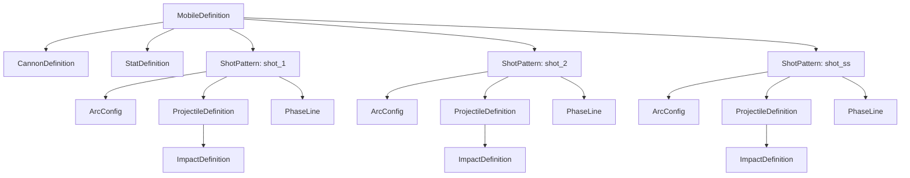
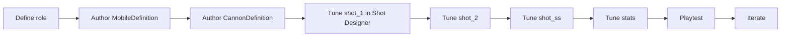

# How to Design a Mobile

See also:
- [Mobile Authoring Reference](./mobile_authoring_reference.md)
- [Shot Designer Guide](./shot_designer_guide.md)
- [Visual Authoring Guide](./visual_authoring_guide.md)

## Purpose

A `Mobile` is a playable unit made from authored resources and runtime shells that already exist in the game. Designing a mobile means giving that unit:

- a readable silhouette and fair hit profile
- a believable cannon mount and launch feel
- three shots with distinct jobs
- stats that support the intended role

This guide is workflow-first. If you need field-by-field details, jump to [Mobile Authoring Reference](./mobile_authoring_reference.md).
For rendering and animation expectations, jump to [Visual Authoring Guide](./visual_authoring_guide.md).

## Mobile Composition

## What To Edit When You Want X

| If you want to change... | Edit... |
| --- | --- |
| Unit size, hit fairness, weak-point placement | `MobileDefinition` |
| Cannon angle band, power band, muzzle position | `CannonDefinition` |
| Projectile count, spacing, stagger, max range | `ShotPattern` |
| Arc feel, gravity, wind sensitivity, power scaling | `ArcConfig` |
| Projectile collision feel and visuals | `ProjectileDefinition` |
| Damage, blast radius, drilling | `ImpactDefinition` |
| Mid-flight wobble, spin, body offset behavior | `PhaseLine` and `PhaseEntry` |
| Survivability and unit role durability | `StatDefinition` |

## Recommended Authoring Order

1. Define the role before touching numbers.
2. Author the unit body and hit zones.
3. Place the cannon mount and verify muzzle feel.
4. Set cannon angle and power limits.
5. Design `shot_1` as the reliable baseline.
6. Design `shot_2` as the situational or expressive tool.
7. Design `shot_ss` as the identity-defining payoff shot.
8. Tune stats to match the finished kit.
9. Preview the shots across multiple angle and power values.
10. Playtest and iterate.

## Start With Role, Not Numbers

Write down these five things before opening the tool:

| Prompt | Example |
| --- | --- |
| Class fantasy | Heavy bunker buster |
| Main strength | Reliable mid-range damage |
| Main weakness | Slow repositioning, punishable weak point |
| `shot_1` role | Bread-and-butter shell |
| `shot_2` role | Area denial or skill shot |
| `shot_ss` role | High-drama signature weapon |

If you skip this step, it is easy to end up with three shots that all solve the same problem.

## Step 1: Shape The Unit

Author the unit shell in `MobileDefinition`.

### Focus fields

| Field | Why it matters |
| --- | --- |
| `body_size` | Physical footprint and silhouette |
| `body_zone_radius` | Ease of landing a normal hit |
| `core_zone_radius` | Ease of landing a high-value hit |
| `core_zone_offset` | How exposed or protected the weak point feels |
| `cannon_mount_offset` | Whether the cannon looks and feels grounded on the chassis |

### Heuristics

- Keep the body hit zone aligned with the visible silhouette.
- Make the core offset express risk: forward/high cores tend to feel vulnerable, central/low cores feel protected.
- Make the cannon mount believable before touching shot values.

Use the `Mobile` authoring gizmos to validate:
- body footprint
- body/core hit zones
- cannon mount
- facing arrow

## Step 2: Shape The Cannon

Author the launch envelope in `CannonDefinition`.

| Field | Feel impact |
| --- | --- |
| `min_angle` | Lowest practical line of fire |
| `max_angle` | Highest arc the unit can reach |
| `initial_angle` | Neutral/starting feel |
| `min_power` | Floor on shot strength |
| `max_power` | Ceiling on shot strength |
| `muzzle_offset` | Visual and physical launch point |

### Good cannon questions

- Can this unit comfortably fire in its intended range band?
- Does the muzzle clear the body cleanly?
- Does the angle range support the shot fantasies you want?

Use the `Cannon` editor gizmos to validate:
- current aim ray
- angle fan
- muzzle marker
- facing direction

## Step 3: Design The Three Shots

Each slot should have a distinct job.

| Slot | Recommended role | Design goal |
| --- | --- | --- |
| `shot_1` | Bread-and-butter | Reliable, readable, low confusion |
| `shot_2` | Situational tool | Different tactical problem than `shot_1` |
| `shot_ss` | Signature payoff | Most expressive and identity-defining |

### Shot identity checklist

- `shot_1` should still feel useful under pressure.
- `shot_2` should not just be "`shot_1`, but bigger."
- `shot_ss` should be exciting without invalidating the rest of the kit.

## Step 4: Tune The Shot Stack

Use the [Shot Designer Guide](./shot_designer_guide.md) for the exact tooling workflow.

Tune these layers in order:

| Layer | Tune for |
| --- | --- |
| `ShotPattern` | Count, spread, stagger, range envelope |
| `ArcConfig` | Arc personality |
| `ProjectileDefinition` | Collision feel and visual read |
| `ImpactDefinition` | Damage, blast, terrain pressure |
| `PhaseLine` | Special movement character |

### Practical tuning order

1. Get the base arc to feel right.
2. Add multi-projectile count and spacing.
3. Add stagger only if it improves the shot’s identity.
4. Set damage and radius after the flight feel is good.
5. Add phase behavior last, when the shot already works without it.

## Step 5: Tune Stats To Match The Kit

Do this after the shots feel good.

| If the kit is... | Then stats should usually... |
| --- | --- |
| High precision, high reward | Leave room for punishment |
| Short range, brawly | Support getting into danger |
| Long range, oppressive | Accept more vulnerability or mobility constraints |
| Terrain-heavy | Avoid also making it dominant in every other dimension |

Stats should support the shot kit, not compensate for a muddy kit.

## Common Failure Modes

| Problem | Usually means |
| --- | --- |
| Core feels impossible to hit | `core_zone_radius` too small or offset too protected |
| Unit looks hittable in places that do not count | hit zones are too detached from the silhouette |
| Muzzle appears to clip or fire through the chassis | `cannon_mount_offset` or `muzzle_offset` needs work |
| All three shots feel the same | shot roles were not defined clearly enough |
| Multi-shot change made the weapon unreadable | count/spacing/stagger were added without re-evaluating the whole pattern |
| Blast radius is carrying the entire weapon | impact tuning is masking weak arc/projectile design |
| The unit only feels right at one power level | cannon or arc envelope is too narrow |

## Review Checklist

- The silhouette and hit zones match.
- The cannon mount looks believable.
- The muzzle location feels correct.
- `shot_1` is reliable.
- `shot_2` is tactically distinct.
- `shot_ss` is memorable.
- The stats reinforce the role instead of rescuing it.
- The unit still reads well under weather variation.

## Suggested Workflow

