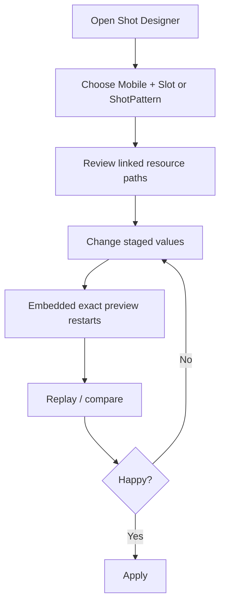

# Shot Designer Guide

See also:
- [How to Design a Mobile](./how_to_design_a_mobile.md)
- [Mobile Authoring Reference](./mobile_authoring_reference.md)
- [Visual Authoring Guide](./visual_authoring_guide.md)

## What It Is

The Shot Designer is an editor dock that lets you tune the full linked shot stack and preview the exact runtime result in-place.

Important rule:

- it does not use a separate ballistic implementation
- it reuses the real preview/runtime path through `BattleSystem`, `ShotExecutionService`, `Cannon`, `Projectile`, weather, and the current shot resources

## What You Can Open

| Entry mode | Use when |
| --- | --- |
| `Mobile + Slot` | You are designing a real unit loadout |
| `ShotPattern` | You want to tune a shared shot directly |

## What The Dock Stages

Edits are staged in memory until you press `Apply`.

### Staged resource layers

| Layer | Editable in the dock |
| --- | --- |
| `ShotPattern` | `unit_count`, `stagger_delay`, `unit_spacing`, `max_range` |
| `ArcConfig` | `gravity`, `wind_factor`, `power_scale` |
| `ProjectileDefinition` | `name`, `collision_radius`, `frame_size`, `frame_count`, `animation_speed` |
| `ImpactDefinition` | `damage`, `radius`, `drill_power` |
| `PhaseLine` / `PhaseEntry` | per-phase duration and linked behavior visibility |

### Preview-only controls

| Control | Purpose |
| --- | --- |
| `angle` | test practical firing angles |
| `power` | test power band feel |
| `facing` | validate left/right presentation |
| `weather` | preview live weather influence |

## Workflow

## Recommended Daily Workflow

1. Open the dock.
2. Choose `Mobile + Slot` when possible.
3. Confirm the linked resource paths shown in the stack sections.
4. Set preview angle, power, facing, and weather.
5. Tune the shot stack in this order:
   - `ArcConfig`
   - `ShotPattern`
   - `ProjectileDefinition`
   - `ImpactDefinition`
   - `PhaseLine`
6. Use `Replay` when you want a clean rerun.
7. Press `Apply` only when the staged values are good.
8. Use `Reset` if the experiment is not working.

## What The Preview Actually Shows

The dock preview uses:

- a real preview `BattleSystem`
- real projectile spawning through `ShotExecutionService`
- real runtime `Projectile` behavior
- real `Cannon` shot-event building
- optional real `Mobile` shell for authored context
- explicit preview boundaries for floor and wall collision

That means:

- count, spacing, and stagger are exact
- muzzle position is exact
- weather-adjusted ballistics are exact
- projectile lifetime and arc are exact for the preview sandbox

## Reading The Preview

| Readout | Meaning |
| --- | --- |
| live projectiles | current in-flight runtime projectiles |
| path lines | captured projectile trajectories |
| endpoints | captured end positions once impacts resolve |
| airtime | max observed runtime airtime |
| spread | horizontal width between endpoints |

## Reset vs Apply

| Action | What it does |
| --- | --- |
| `Reset` | discards staged edits and reloads source resources |
| `Apply` | saves staged edits back into the linked resource files |
| `Replay` | reruns preview without changing staged values |

## Shared Resource Safety

The dock shows real backing resource paths for a reason.

Before pressing `Apply`, verify:

- which `ShotPattern` is being edited
- which `ArcConfig` is linked
- which `ProjectileDefinition` is linked
- which `ImpactDefinition` is linked
- whether the `PhaseLine` and `PhaseEntry` assets are shared elsewhere

## Good Tuning Habits

- Change one layer at a time.
- Validate at more than one power value.
- Validate at more than one angle.
- Check both facing directions for presentation issues.
- Use weather presets before locking in the final feel.

## Common Pitfalls

| Pitfall | Better move |
| --- | --- |
| Increase damage first | fix arc and projectile feel first |
| Add more projectiles immediately | first ask whether the shot needs more coverage or more clarity |
| Tune only at one angle | test shallow, medium, and steep |
| Ignore resource paths | confirm shared-resource blast radius before `Apply` |
| Add phase behavior too early | get the base shot working first |

## Suggested Tuning Order Per Shot

### `shot_1`

- prioritize clarity
- prioritize reliability
- avoid gimmicks unless they are extremely readable

### `shot_2`

- add the tactical wrinkle
- solve a different problem than `shot_1`
- accept a little more execution demand

### `shot_ss`

- lean into identity
- make the payoff obvious
- keep the cost or constraint readable
