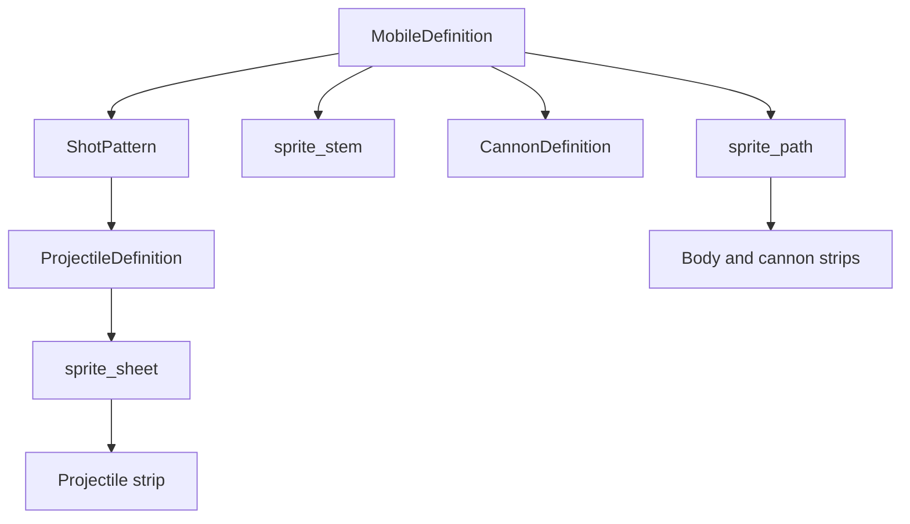

# Visual Authoring Guide

See also:
- [How to Design a Mobile](./how_to_design_a_mobile.md)
- [Mobile Authoring Reference](./mobile_authoring_reference.md)
- [Mobile Asset Checklist](./mobile_asset_checklist.md)

## Purpose

This guide defines the rendering and animation contract for mobile and projectile assets.

The current baseline is cleaned up around Ironclad, but the rules below are meant to describe the actual authoring contract for new content.

## Visual Stack

## Folder Layout

| Asset type | Expected location |
| --- | --- |
| Mobile body and cannon sheets | `roster/mobiles/<unit>/sprites/` |
| Projectile sheets | `assets/projectiles/<unit>/` |

## Mobile Sprite Lookup

The runtime builds body and cannon sheets from:

- `MobileDefinition.sprite_path`
- `MobileDefinition.sprite_stem` if set
- otherwise `MobileDefinition.name.to_lower()`

Recommended rule:

- always set `sprite_stem` explicitly

That keeps artist-friendly or player-facing name changes from breaking sprite filenames.

## Expected Mobile Filenames

| Asset | Filename |
| --- | --- |
| Body idle | `<stem>_body_idle.png` |
| Body walk | `<stem>_body_walk.png` |
| Body aim | `<stem>_body_aim.png` |
| Body charge | `<stem>_body_charge.png` |
| Body fire | `<stem>_body_fire.png` |
| Body hit | `<stem>_body_hit.png` |
| Body die | `<stem>_body_die.png` |
| Cannon idle | `<stem>_cannon_idle.png` |
| Cannon charge | `<stem>_cannon_charge.png` |
| Cannon fire | `<stem>_cannon_fire.png` |

## Mobile Sheet Dimensions

### Body sheets

| Property | Standard |
| --- | --- |
| Cell size | `48x48` |
| Layout | single-row horizontal strip |

### Cannon sheets

| Property | Standard |
| --- | --- |
| Cell size | `32x32` |
| Layout | single-row horizontal strip |

## Body Animation Contract

| Animation | Intended frames | Loop | Notes |
| --- | --- | --- | --- |
| `idle` | `4` | yes | baseline neutral |
| `walk` | `6` | yes | locomotion |
| `aim` | up to `4` | yes | optional readability accent |
| `charge` | `4` | yes | charge loop |
| `fire` | `4` | no | shot response |
| `hit` | `3` | no | damage reaction |
| `die` | `8` | no | death sequence |

## Cannon Animation Contract

| Animation | Intended frames | Loop | Notes |
| --- | --- | --- | --- |
| `idle` | up to `2` | yes | can be static or subtly animated |
| `charge` | up to `4` | yes | charge loop |
| `fire` | `4` | no | recoil / release |

## Required vs Optional

### Required for a production-ready mobile

- `body_idle`
- `body_walk`
- `body_fire`
- `body_hit`
- `body_die`
- `cannon_idle`
- `cannon_fire`

### Strongly recommended

- `body_charge`
- `body_aim`
- `cannon_charge`

### Runtime behavior

- missing strips do not hard-crash the runtime
- missing strips do generate warnings when sprite frames are built
- the runtime now clamps consumed frames to the texture width, so shorter strips are tolerated better than before

Use that tolerance as a safety net, not as the intended content standard.

## Alignment Rules

### Body silhouette

- keep the painted chassis centered on the `Mobile` origin
- keep the visual footprint consistent with the authored hit zones
- avoid large decorative overhangs unless the mismatch is intentional and tested

### Cannon and muzzle

- align barrel art to `CannonDefinition.barrel_sprite_offset`
- align the visible muzzle to `CannonDefinition.muzzle_offset`
- validate in-editor using the `Cannon` gizmos:
  - mount marker
  - muzzle marker
  - aim ray
  - angle fan

### Status headroom

- leave clear vertical room above the unit for status badges
- very tall silhouettes should be checked directly in the editor shell

## Projectile Sprite Contract

Projectile visuals are authored on `ProjectileDefinition`.

| Field | Meaning |
| --- | --- |
| `sprite_sheet` | projectile strip texture |
| `frame_size` | frame cell size |
| `frame_count` | number of frames to consume |
| `animation_speed` | playback speed |
| `collision_radius` | gameplay collision size |

Recommended rule:

- always set `frame_size`
- always set `frame_count`
- do not rely on the defaults unless the sheet really is `16x16 x 4`

## Ironclad Projectile Baseline

| Projectile | Sheet size | Authored frame size | Authored frame count |
| --- | --- | --- | --- |
| `S1` | `64x16` | `16x16` | `4` |
| `S2` | `96x24` | `24x24` | `4` |
| `SS` | `192x32` | `32x32` | `6` |

## Art Hand-off Checklist

When handing off to art, include:

- role and fantasy
- body footprint
- cannon mount location
- muzzle location
- required animation list
- projectile silhouette and approximate collision feel

The goal is that the artist is not guessing the gameplay footprint from the concept alone.

## Common Visual Failure Modes

| Problem | Usually means |
| --- | --- |
| Cannon looks like it fires from the wrong place | muzzle offset and art are misaligned |
| Weak point feels unfair | core zone and silhouette disagree |
| Projectile reads huge but hits tiny | collision radius is too small |
| Renaming the unit breaks visuals | `sprite_stem` was left blank |
| Animation pops between states | strip framing is inconsistent |

